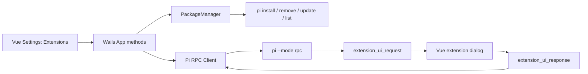

# Pi Package Bridge V1 Design

## Goal

Add first-version support for Pi packages to Pi Desktop without reimplementing Pi's package manager. Users manage packages from the existing settings panel, discover package commands through slash completion, and interact with common extension UI requests through Vue dialogs.

This design targets the package model documented by Pi:

- Extensions
- Skills
- Prompt templates
- Themes

Pi Desktop will support package installation and runtime loading for these package types. Pi terminal themes, custom status bars, and custom widgets are outside the first-version UI scope because they target Pi's terminal interface rather than the Vue desktop interface.

## Confirmed Product Decisions

- Add an `Extensions` tab to the existing settings panel rather than creating a separate extension marketplace page.
- Default package operations to the current project configuration, with an explicit switch for global operations.
- Accept Pi-native source formats: npm packages, Git URLs, and local paths.
- Automatically restart the Pi RPC agent after successful package changes and restore the active session when possible.
- Support extension UI methods `select`, `confirm`, `input`, `editor`, and `notify`.
- Add slash-command completion for commands reported by Pi RPC.
- Link to `https://pi.dev/packages/` for catalog browsing. Online catalog search is not part of V1.

## Architecture

Pi Desktop will keep Pi as the source of truth for package installation, configuration, and runtime loading.

### PackageManager

Add a Go package manager component responsible for:

- Resolving the Pi executable using the same lookup behavior as the RPC client.
- Running Pi package CLI commands with a bounded timeout.
- Selecting project or global scope.
- Capturing stdout and stderr for user-facing errors.
- Validating project directories and local package paths before execution.
- Returning structured package operation results to the Wails layer.

The Wails layer will expose methods for:

- Listing configured packages for a scope.
- Installing a package source.
- Removing a package source.
- Updating one package or all packages.
- Retrying Agent startup after a failed restart.

The exact CLI flags and result parsing must follow the installed Pi CLI version during implementation. The desktop application must not edit Pi package configuration files directly.

### Agent Restart

After a successful install, remove, or update:

1. Capture the current working directory and active session path.
2. Stop the current Pi RPC child process.
3. Start a fresh Pi RPC child process in the same working directory.
4. Restore the active session when a session path exists.
5. Refresh agent state, package list, and slash-command list.

If the package operation fails, do not restart the Agent. If restart fails after a successful package operation, keep the desktop application open, show the error, and offer `Retry Agent Startup`.

## Settings UI

Add an `Extensions` tab to the current settings panel.

The tab contains:

- Scope switch: `Current Project` and `Global`.
- Package source input accepting npm package references, Git URLs, and local paths.
- `Install` action.
- `Browse Package Catalog` link opening `https://pi.dev/packages/`.
- Installed package list with source, scope, and type when available.
- Per-package `Update` and `Remove` actions.
- `Update All` action.
- Loading state that prevents duplicate operations.
- Success and error feedback.
- Restart status while the Agent reloads packages.

Before installation, show a security confirmation explaining that third-party extensions may read local files and execute commands with the user's permissions.

## Slash-Command Completion

Use the existing `get_commands` RPC command exposed by the Go backend.

When the user types `/` or `/text` into the message input:

- Load and filter available commands.
- Show command name, description, and source.
- Support sources `extension`, `prompt`, and `skill`.
- Allow keyboard navigation, selection, and dismissal.
- Insert the chosen command into the input without changing ordinary message behavior.

If command loading fails, silently disable completion while leaving normal chat input usable.

## Extension UI Bridge

Pi RPC runtime events are forwarded through the existing Wails `pi-event` channel. Extend the event model so the frontend receives the fields required by extension UI requests.

V1 supports:

| Method | Desktop behavior |
| --- | --- |
| `select` | Single-choice list dialog |
| `confirm` | Confirm / cancel dialog |
| `input` | Single-line text dialog |
| `editor` | Multi-line text dialog |
| `notify` | Non-blocking notification |

Add a Wails method that sends an `extension_ui_response` command to the active Pi RPC client.

Only one blocking dialog is active at a time. Additional blocking requests are queued. Closing a dialog returns a cancellation result. Unknown request methods also return cancellation so extensions do not wait indefinitely.

Pending extension UI requests are cleared when the Agent stops, a session changes, or the current operation is aborted.

## Error Handling

- Apply timeouts to Pi CLI package operations.
- Return readable errors based on stdout and stderr.
- Validate local package paths before invoking Pi.
- Require a valid current working directory for project-scoped operations.
- Keep the current Agent running when a package operation fails.
- Show a recoverable error when Agent restart fails.
- Degrade gracefully when slash-command loading fails.
- Cancel unsupported extension UI methods rather than leaving extensions blocked.

## Testing

### Go

- Test CLI argument construction for project and global scope.
- Test npm, Git URL, and local path sources.
- Test local path validation.
- Test timeouts and stderr-based failures.
- Test successful package changes trigger Agent restart and session restoration.
- Test failed package changes do not restart the Agent.

### RPC Bridge

- Test forwarding fields required by `extension_ui_request`.
- Test sending `extension_ui_response`.
- Test supported dialog methods and cancellation behavior.
- Test pending request cleanup when the Agent stops.

### Vue

- Test scope switching, security confirmation, operation loading state, success state, and error state.
- Test package list refresh after Agent restart.
- Test dialogs for `select`, `confirm`, `input`, and `editor`.
- Test non-blocking `notify` notifications.
- Test dialog queuing and cancellation.
- Test slash completion opening, filtering, keyboard selection, dismissal, and normal message fallback.

### Verification

Before completion:

1. Run Go tests.
2. Run frontend type checking.
3. Run the frontend production build.
4. Start Wails development mode.
5. Manually verify project-scoped package listing, slash completion, and each supported extension UI method with a suitable test extension or fixture.

## Out Of Scope

- Searching the online Pi package catalog inside Pi Desktop.
- Rendering Pi terminal themes as Vue themes.
- Recreating Pi terminal status bars.
- Recreating custom terminal widgets.
- Supporting multiple simultaneous blocking extension dialogs.

